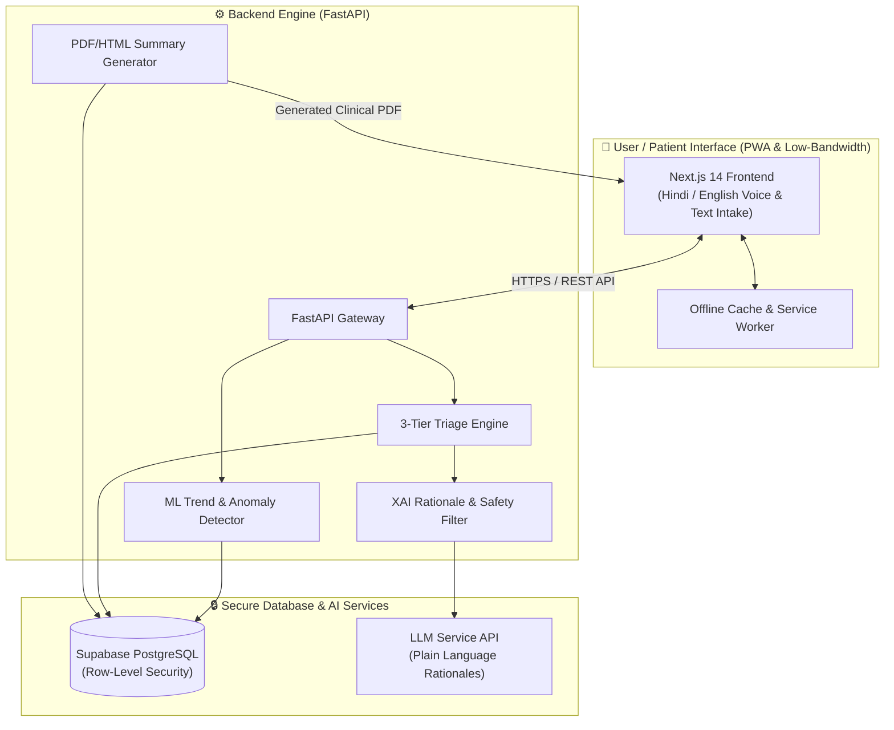

<div align="center">

# 🩺 PulseCareAI
### *AI-Powered Health Companion — Symptom Triage & Chronic Disease Self-Management*

[](#-team-pulsecoders)
[](#-team-pulsecoders)
[](#-team-pulsecoders)
[](#)
[](#)

---

**Empowering semi-urban & rural communities with privacy-first, low-bandwidth AI triage and proactive chronic care management.**

[Key Features](#-key-features) • [System Architecture](#-system-architecture) • [Tech Stack](#-tech-stack) • [Getting Started](#-getting-started) • [Real-World Impact](#-real-world-impact) • [Team](#-team-pulsecoders)

</div>

---

## 📌 Problem Statement & Vision

In semi-urban and rural India, access to timely primary healthcare remains a critical bottleneck. Millions of patients face severe challenges:
- **Delayed Intervention**: Patients frequently ignore or delay care for serious symptoms due to distance, financial constraints, or lack of medical awareness.
- **Overcrowded Emergency Facilities**: Non-urgent health issues flood tertiary hospitals, stretching emergency resources thin.
- **Chronic Disease Mismanagement**: Conditions like **Type 2 Diabetes** and **Hypertension** suffer from low treatment adherence, unmonitored fluctuations, and information overload.

### 💡 The Solution: PulseCareAI
**PulseCareAI** bridges the primary care gap by delivering an intelligent, privacy-preserving, and low-bandwidth healthcare companion. It empowers patients with **instant, explainable triage recommendations** while giving clinicians **actionable, automated summaries** for continuity of care.

---

## ✨ Key Features

### 1. 🚦 Smart Symptom Triage Engine
An intelligent 3-tier clinical decision support system evaluating user-reported symptoms and basic vitals.
* **Multi-Modal Intake**: Supports text chat, basic vital inputs (blood pressure, glucose, temperature), and **voice-to-text intake** for accessibility.
* **3-Tier Decision Framework**:
  * 🟢 **Home Care**: Self-management instructions, hydration/rest guidance, and monitoring parameters.
  * 🟡 **Consult within 48 Hours**: Recommended visit to a primary health center or local doctor.
  * 🔴 **Proceed Immediately to Facility**: Urgent red-flag warning with emergency referral guidance.
* **Explainable AI (XAI)**:
  * Plain-language rationales explaining *why* a specific recommendation was made.
  * Explicit **Red-Flag Alerting** for high-risk symptoms (e.g., chest pain, severe dyspnea).
  * Transparent **Confidence & Uncertainty Scores** to build trust and encourage doctor consultation when borderline.

### 2. 📊 Chronic Disease Self-Management *(Focus: Type 2 Diabetes & Hypertension)*
* **Daily Metric Tracking**: Simple logging interface for blood glucose, blood pressure, weight, and medication compliance.
* **Predictive Trend Detection**: ML models detect adverse health trends (e.g., multi-day glucose spikes or progressive hypertension) before acute complications occur.
* **Behavioral Nudges**: Hyper-personalized, contextual reminders promoting medication adherence, diet adjustments, and physical activity.
* **Automated Clinician Summary**: Generates shareable, clinical-grade **PDF/HTML weekly reports** that summarize vital trends and risk alerts for doctor visits.

### 3. 🌐 Low-Bandwidth & Privacy-First Architecture
* **PWA & Low-Bandwidth Resiliency**: Lightweight Next.js frontend built as a Progressive Web App (PWA) optimized for 2G/3G networks in remote areas.
* **Multilingual Localization**: Seamless English & Hindi support designed for rural accessibility.
* **Resource Directory Integration**: Smart mapping to local primary health centers, clinics, and emergency contacts.
* **Privacy-First Data Protection**: User-consented data storage backed by Supabase Row-Level Security (RLS) and end-to-end data encryption.

---

## 🏗️ System Architecture



---

## 🛠️ Tech Stack & Rationale

| Layer | Technology | Rationale / Strategic Advantage |
| :--- | :--- | :--- |
| **Frontend Framework** | **Next.js 14 (React) & Tailwind CSS** | Server-side rendering, blazingly fast load times, and responsive UI for low-end mobile devices. |
| **PWA Resilience** | **Workbox / Service Workers** | Enables offline caching and low-bandwidth operation in rural 2G/3G zones. |
| **Backend Framework** | **Python (FastAPI & Uvicorn)** | High-performance asynchronous API framework ideal for ML model serving and rapid request processing. |
| **Database & Auth** | **Supabase (PostgreSQL)** | Enterprise-grade security with Row Level Security (RLS), real-time sync, and patient data protection. |
| **AI / ML & XAI** | **Scikit-Learn / PyTorch & LLM APIs** | Quantitative trend detection paired with explainable AI for safe, plain-language clinical rationales. |
| **PDF Generation** | **ReportLab / WeasyPrint** | Programmatic generation of structured, clinical-grade patient summaries for doctors. |

---

## 🚀 Getting Started (Local Development)

Follow these instructions to set up PulseCareAI on your local machine.

### 📋 Prerequisites
* **Node.js**: v18.0.0 or higher
* **Python**: v3.9 or higher
* **Git**: Installed on your system

---

### 1️⃣ Clone the Repository
```bash
git clone https://github.com/yourusername/pulsecare-ai.git
cd pulsecare-ai
```

---

### 2️⃣ Frontend Setup (Next.js)
```bash
# Navigate to frontend directory
cd frontend

# Install dependencies
npm install

# Start development server
npm run dev
```
> The frontend application will be running at `http://localhost:3000`.

---

### 3️⃣ Backend Setup (FastAPI)
```bash
# Navigate to backend directory (from project root)
cd backend

# Create and activate virtual environment
# On Linux/macOS:
python3 -m venv venv
source venv/bin/activate

# On Windows:
python -m venv venv
venv\Scripts\activate

# Install required Python packages
pip install -r requirements.txt

# Launch FastAPI server
uvicorn main:app --reload
```
> The backend API documentation (Swagger UI) will be available at `http://localhost:8000/docs`.

---

## 🎯 Real-World Impact & Alignment

> [!IMPORTANT]
> **Aligned with National Digital Health Goals**
> PulseCareAI is designed in synergy with the **India AI Mission** and the **Ayushman Bharat Digital Mission (ABDM)** framework to democratize healthcare AI for underserved populations.

* 📉 **Reduces Emergency Overcrowding**: Diverts non-emergency cases to home care or primary health centers.
* ⚡ **Early Intervention**: Catches adverse diabetes/hypertension trends early, reducing expensive hospitalizations.
* 🌐 **Health Equity**: Language and bandwidth barriers are dismantled through voice intake and low-latency PWA design.

---

## 🗺️ Future Roadmap

- [ ] **ABHA ID Integration**: Seamless authentication with Ayushman Bharat Health Account (ABHA).
- [ ] **IoT Device Sync**: Bluetooth integration with low-cost blood pressure monitors & glucometers.
- [ ] **Expanded Disease Modules**: Adding support for Asthma, COPD, and Maternal Health tracking.
- [ ] **Full Offline LLM Edge Inference**: Deploying quantized ML models locally on the mobile device.

---

## 👥 Team PulseCoders

Developed with ❤️ by **Team PulseCoders** for **TetraTHON 2026 (HealthTech Track)**.

| Name | Role | Contact |
| :--- | :--- | :--- |
| **Krish Patel** | Lead Developer / AI Systems | [krishpatel27x@gmail.com](mailto:krishpatel27x@gmail.com) |
| **Varun Prajapati** |  Backend & ML Engineer| [Vnp785@gmail.com](mailto:Vnp785@gmail.com) |
| **Rudra Manger** | Full-Stack & UI/UX Developer | [rudramanger2006@gmail.com](mailto:rudramanger2006@gmail.com) |

---

<div align="center">

*Powered by **India AI Mission** in collaboration with **ISEN Méditerranée***

⭐ If you like this project, please consider giving it a star on GitHub!

</div>
